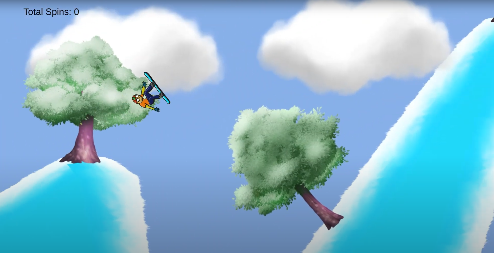
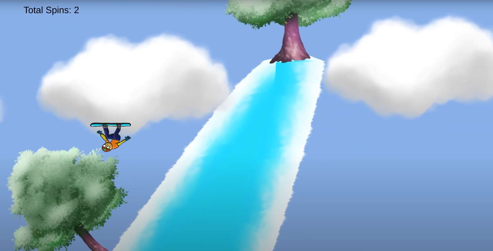
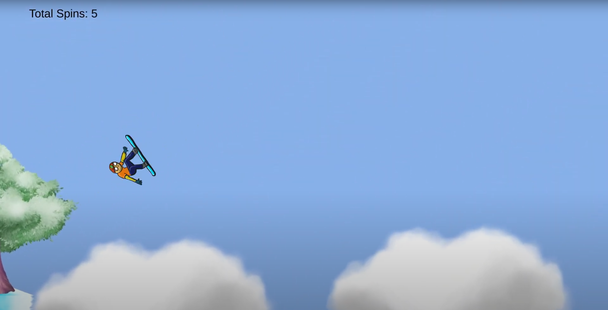
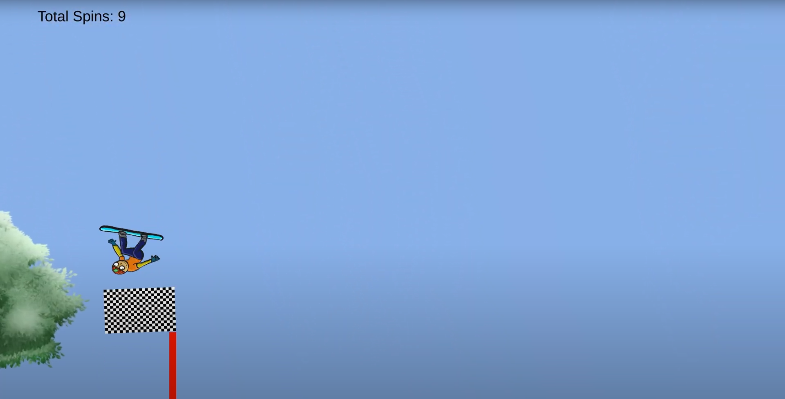
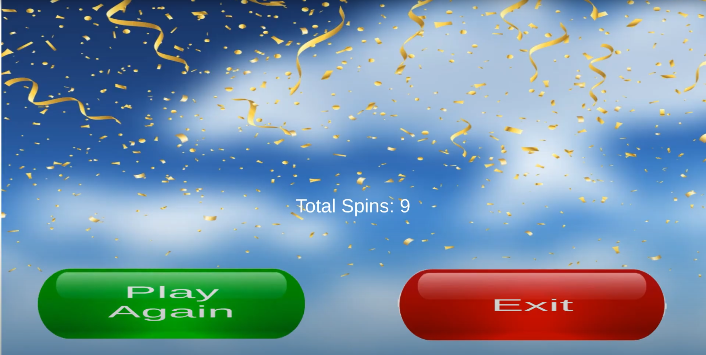
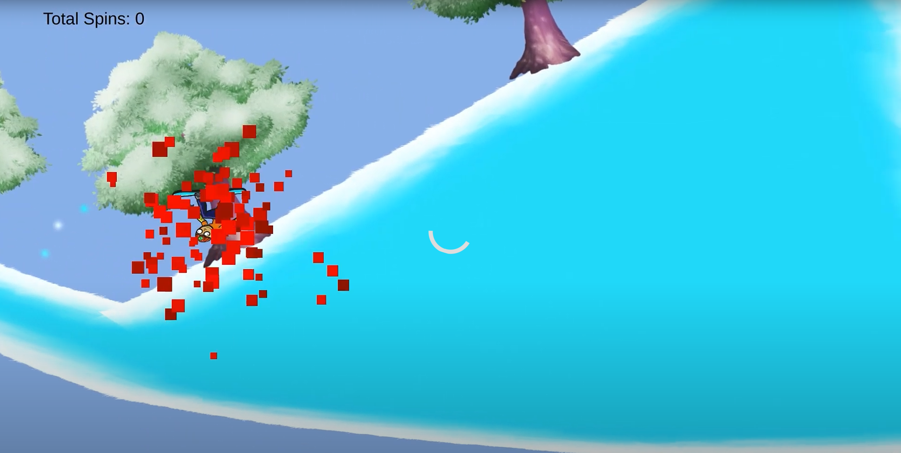
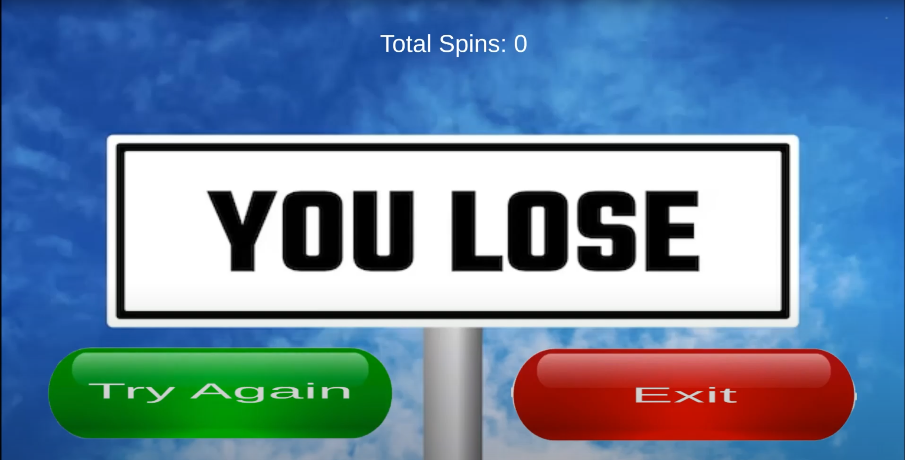

# 🎿 Alp Skis – Flip, Slide, and Conquer with Alp!

**Alp Skis** is a fast-paced and stylish skiing game where you control **Alp**, a fearless skier racing down icy slopes. Master aerial tricks, time your movements, and glide to victory — or tumble in the snow!

---

## 🕹️ Gameplay Overview

Join Alp as he tackles steep slopes and chilly winds in an action-packed skiing adventure:

- ⬆️ **Hold the Up Arrow** to accelerate and glide faster.
- ⬅️➡️ **Use the Left and Right Arrows** to perform flips and spins in mid-air.
- ✅ **Land safely** to keep going — a bad landing ends your run!

---

## 🎯 Scoring System

- Your **total number of successful spins** is tracked throughout the run.
- Once you finish — or fall — your final spin count is displayed.
- **Can you set a new record?** Try again and beat your best!

---

## 🌟 Features

- ❄️ **Smooth skiing physics**
- 🎇 **Dynamic particle effects**
- 🔊 **Immersive sound design**
- 🎿 **Stylish aerial tricks**
- 🎮 Fast, reflex-based controls

---

## 🖼️ Screenshots

### ❄️ Speeding Down the Slope

### ✨ Mid-Air Trick

### ✨ Mid-Air Trick

### ✨ Mid-Air Trick

### 🏁 Victory Screen

###  Fall Dawn

### 🏁 Victory Screen

---

## 🎥 Gameplay Video

---

## 🎮 Built With

- 🛠️ **Unity Engine**
- 🎿 Custom skiing physics
- 💥 Particle and animation effects
- 📊 Real-time score tracking
- 🔊 Sound FX and music feedback

---

## 📬 Contact

Developed by [Muhammed Alperen Karaçete]  
Feedback or inquiries: [m.alperenk@gmail.com]
